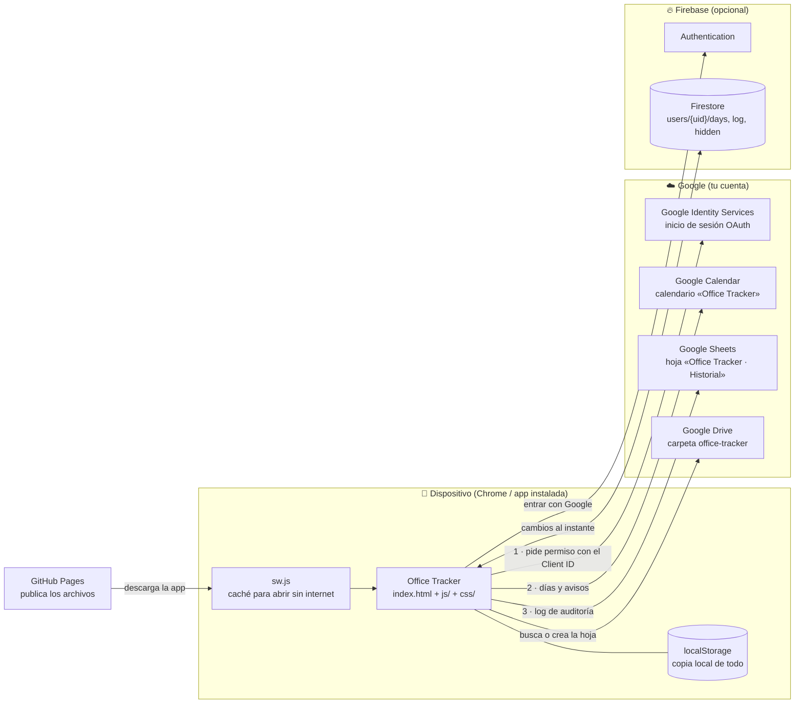
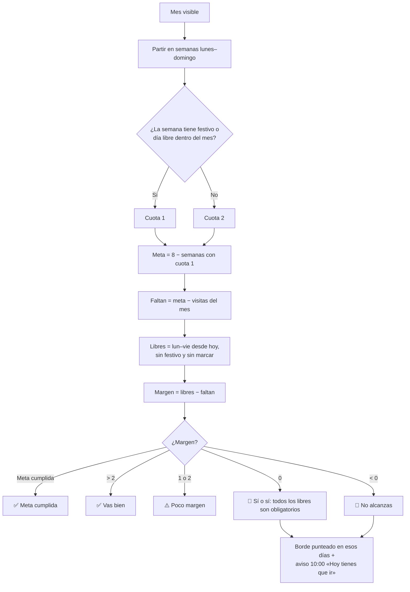
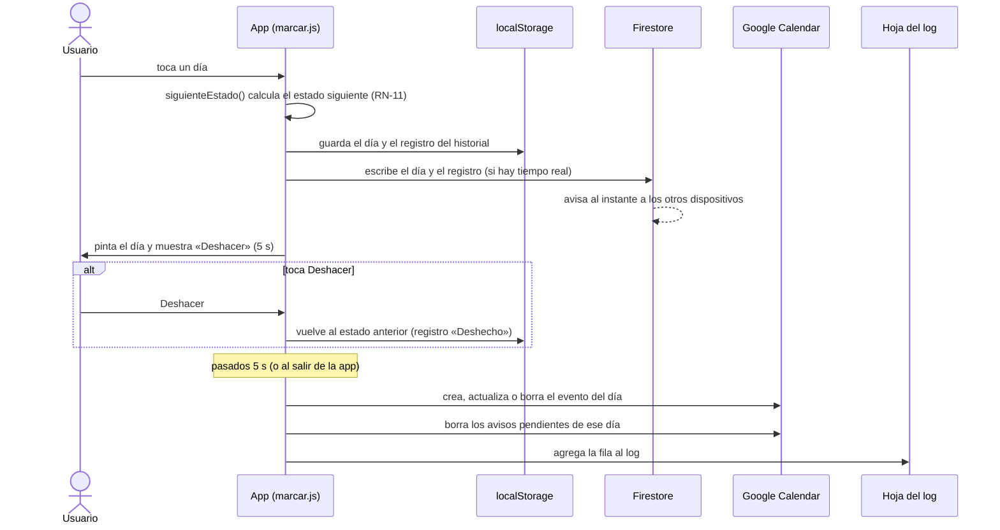
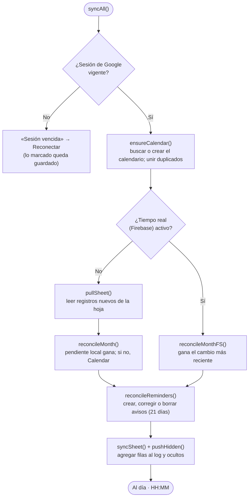
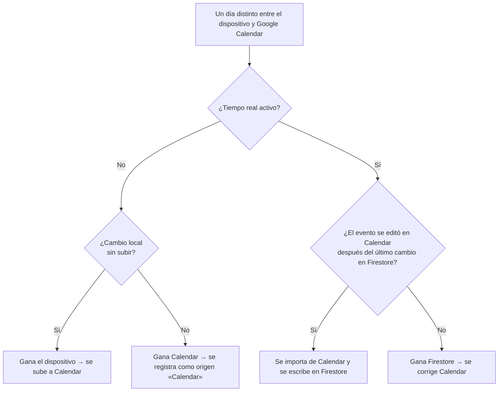
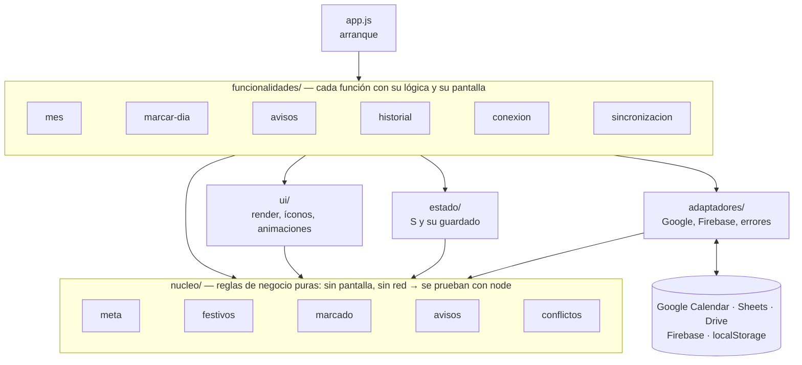

# 🏢 ScotiaTech Office Tracker — PWA

App web instalable (PWA) para llevar la cuenta de las visitas a la oficina contra una **meta mensual**, con festivos colombianos automáticos, sincronización con un calendario propio en Google Calendar, avisos diarios, historial de auditoría en Google Sheets y, opcionalmente, sincronización en tiempo real entre dispositivos con Firebase.

No tiene servidor propio: son archivos estáticos publicados en GitHub Pages. Todo corre en el navegador del dispositivo, que habla directamente con las APIs de Google y Firebase.

**App publicada:** `https://johansparra.github.io/office-tracker`

---

## Índice

1. [Reglas de negocio](#1-reglas-de-negocio)
2. [Cómo funciona (diagramas)](#2-cómo-funciona-diagramas)
3. [Archivos del repositorio](#3-archivos-del-repositorio)
4. [Estructura del código y cómo modificarlo](#4-estructura-del-código-y-cómo-modificarlo)
5. [Servicios externos: qué hace cada uno y por qué](#5-servicios-externos-qué-hace-cada-uno-y-por-qué)
6. [Manual paso a paso: instalación, configuración y uso](#6-manual-paso-a-paso-instalación-configuración-y-uso)

---

## 1. Reglas de negocio

Cada regla dice **dónde está en el código**, para cambiarla sin buscar, y tiene una prueba con el mismo número en [tests/reglas.test.mjs](tests/reglas.test.mjs) (ver [sección 4.5](#45-pruebas)). Las reglas puras viven en [js/nucleo/](js/nucleo/).

### 1.1 Meta mensual

| # | Regla | Código |
|---|---|---|
| RN-01 | La meta base es **8 visitas al mes**. | `BASE` en [js/nucleo/constantes.js](js/nucleo/constantes.js) |
| RN-02 | Las semanas van de **lunes a domingo**. Lo ideal son **2 visitas por semana**. | `weeks()` en [js/nucleo/meta.js](js/nucleo/meta.js) |
| RN-03 | Una semana con **un festivo o un día libre/vacación** tiene cuota **1** en vez de 2. El festivo cuenta **cualquier día**, incluso sábado o domingo. | `calcularMes()` → `hasAdj` |
| RN-04 | **Meta ajustada = 8 − número de semanas con festivo o día libre** (nunca menos de 0). | `calcularMes()` → `target` |
| RN-05 | **Semanas que cruzan de mes:** se muestran completas, pero solo cuentan los días del mes visible (visitas, festivos y días libres). Ningún día suma en dos meses. | `calcularMes()` → `inMonth` |
| RN-06 | Una **visita** es un día marcado como 🏢 Oficina, incluido un festivo entre semana. Las visitas por encima de la meta cuentan como extra. | `calcularMes()` → `visited` |

**Ejemplo:** octubre 2026 tiene el festivo del lunes 12 (Día de la Raza). Esa semana tiene cuota 1 → meta = 8 − 1 = **7**.

### 1.2 Alertas: margen y días obligatorios

| # | Regla | Código |
|---|---|---|
| RN-07 | **Días hábiles libres** = días de lunes a viernes, **desde hoy** hasta fin de mes, que no son festivo y aún no están marcados. | `calcularMes()` → `open` |
| RN-08 | **Margen = días hábiles libres − visitas que faltan.** Lo que manda es la meta del mes, no las 2 por semana. | `calcularMes()` → `slack` |
| RN-09 | Según el margen, la tarjeta del mes muestra: | `estadoMes()` en [js/nucleo/meta.js](js/nucleo/meta.js); textos en `renderMes()` de [js/funcionalidades/mes/vista.js](js/funcionalidades/mes/vista.js) |

| Situación | Mensaje |
|---|---|
| Meta cumplida | ✅ *Meta cumplida* (y cuántas de más) |
| Margen mayor que 2 | ✅ *Vas bien* y el margen |
| Margen 1 o 2 | ⚠️ *Poco margen: solo puedes faltar N* |
| Margen 0 | 🚨 **Tienes que ir sí o sí** y la lista de días |
| Margen negativo | 🚨 **No alcanzas la meta** y los días que aún puedes ir |
| Mes que ya pasó | *El mes cerró con X de Y visitas* |

| # | Regla | Código |
|---|---|---|
| RN-10 | Con margen 0 o negativo, **todos los días hábiles libres son obligatorios**: se marcan con borde rojo punteado (leyenda *Obligatorio*) y su aviso de las 10:00 cambia a **"⚠️ Hoy tienes que ir a la oficina"**. Si el día deja de ser obligatorio, el aviso vuelve a su texto normal. | `calcularMes()` → `must`, `tituloAviso()` en [js/nucleo/avisos.js](js/nucleo/avisos.js) |

### 1.3 Marcar días

| # | Regla | Código |
|---|---|---|
| RN-11 | Cada toque avanza el estado del día según su tipo: | `siguienteEstado()` en [js/nucleo/marcado.js](js/nucleo/marcado.js) |

| Tipo de día | Ciclo de toques |
|---|---|
| Día hábil | vacío → 🏢 Oficina → 🏖️ Día libre → vacío |
| Festivo entre semana | vacío → 🏢 Oficina → vacío |
| Sábado o domingo | vacío → 🏖️ Día libre (cuenta como festivo de esa semana) → vacío |

| # | Regla | Código |
|---|---|---|
| RN-12 | Cada cambio se ve al instante, pero espera **5 segundos** con un botón **Deshacer** antes de subirse a Google. Si sales de la app antes, se sube de inmediato. | `UNDO_MS`; `applyChange()`, `schedulePush()`, `flushPushes()` en [js/funcionalidades/marcar-dia/marcar.js](js/funcionalidades/marcar-dia/marcar.js) |
| RN-13 | La app funciona **sin cuenta de Google**: los datos quedan en el dispositivo (`localStorage`). Google y Firebase son opcionales. | [js/estado/almacenamiento.js](js/estado/almacenamiento.js) |

### 1.4 Festivos de Colombia

| # | Regla | Código |
|---|---|---|
| RN-14 | Los festivos se calculan solos para cualquier año: no hay que marcarlos. | `holidays()` en [js/nucleo/festivos.js](js/nucleo/festivos.js) |

| Tipo | Festivos | Cálculo |
|---|---|---|
| Fijos | Año Nuevo, Día del Trabajo, Independencia, Batalla de Boyacá, Inmaculada Concepción, Navidad | Fecha fija |
| Ley Emiliani | Reyes Magos, San José, San Pedro y San Pablo, Asunción, Día de la Raza, Todos los Santos, Independencia de Cartagena | Se mueven al lunes siguiente |
| Semana Santa | Jueves Santo, Viernes Santo, Ascensión, Corpus Christi, Sagrado Corazón | Relativos a la Pascua (los tres últimos, al lunes) |

### 1.5 Avisos diarios

| # | Regla | Código |
|---|---|---|
| RN-15 | Hay dos avisos por día: **10:00 a. m.** "¿Vas a la oficina hoy?" y **4:30 p. m.** "¿Fuiste a la oficina hoy?", hora de Bogotá. | `SLOTS` en [js/nucleo/constantes.js](js/nucleo/constantes.js) |
| RN-16 | Solo de **lunes a viernes**, sin festivos, en días **sin marcar**, y solo para horas que aún no pasaron. Se programan **21 días** hacia adelante. | `avisosDeseados()` en [js/nucleo/avisos.js](js/nucleo/avisos.js), `HORIZON` |
| RN-17 | Al marcar un día se borran sus avisos pendientes (si confirmas a las 11, no suena el de las 4:30). | `syncRemindersForDate()` en [js/funcionalidades/avisos/programar.js](js/funcionalidades/avisos/programar.js) |
| RN-18 | Cada aviso trae un enlace con un **código único**. Al abrirlo, la app verifica que el código corresponda a ese día: **Aviso ✓** (verificado), **Aviso ⚠** (no coincide) o **Aviso ?** (no se pudo verificar). | `verifyNonce()` en [js/funcionalidades/avisos/enlace.js](js/funcionalidades/avisos/enlace.js) |
| RN-19 | Desde el aviso se puede responder **Fui a la oficina**, **Día libre** u **Hoy no fui**. *Hoy no fui* no cambia el día, pero cancela el aviso que quede ese día y queda registrado. | `openNotifSheet()` |

### 1.6 Sincronización y conflictos

| # | Regla | Código |
|---|---|---|
| RN-20 | Hay **un solo calendario "Office Tracker" por cuenta de Google**. Si aparecen varios (dos dispositivos conectándose a la vez), todos eligen el de id menor, le copian los días de los otros y borran los sobrantes. **Nunca** se crea uno nuevo sin haber podido buscar antes. | `ensureCalendar()` en [js/funcionalidades/sincronizacion/reconciliar.js](js/funcionalidades/sincronizacion/reconciliar.js), `mergeCalendar()` en [js/adaptadores/google-calendar.js](js/adaptadores/google-calendar.js) |
| RN-21 | Un evento de día completo del calendario Office Tracker con 🏢, "oficina" u "office" en el título es **Oficina**; con 🏖️, "libre" o "vacaciones" es **Día libre**. Cualquier otro evento de día en ese calendario cuenta como Oficina. | `classify()` en [js/nucleo/conflictos.js](js/nucleo/conflictos.js) |
| RN-22 | **Sin Firebase:** si un día tiene un cambio local aún sin subir (punto azul), **gana el dispositivo**. Si no, **gana Google Calendar**. | `importarDeCalendar()` en [js/nucleo/conflictos.js](js/nucleo/conflictos.js), aplicada en `reconcileMonth()` |
| RN-23 | **Con Firebase:** Firestore es la fuente de verdad. Cada día guarda la hora de su último cambio y **gana el cambio más reciente**. Una edición hecha directamente en Google Calendar solo se importa si es **posterior** al último cambio en Firestore; si no, se corrige Calendar. | `decidirDiaConFirebase()` y `decidirDiaRemoto()` en [js/nucleo/conflictos.js](js/nucleo/conflictos.js), aplicadas en `reconcileMonthFS()` y [js/funcionalidades/sincronizacion/tiempo-real.js](js/funcionalidades/sincronizacion/tiempo-real.js) |
| RN-24 | Al unirse a un calendario existente (segundo dispositivo), gana lo que ya está en Google; solo se suben los días que Google no tiene. Lo mismo con Firestore la primera vez. | `diasEnCalendario()` en [js/nucleo/conflictos.js](js/nucleo/conflictos.js), usada en `ensureCalendar()`; `onFsDays()` |
| RN-25 | Si un día tiene varios eventos, se deja uno y se borran los duplicados. | `elegirEvento()` en [js/nucleo/conflictos.js](js/nucleo/conflictos.js) |

### 1.7 Historial y auditoría

| # | Regla | Código |
|---|---|---|
| RN-26 | **Todo cambio queda registrado** con: id único, fecha y hora exacta, día, estado anterior y nuevo, **origen** (Manual, Aviso ✓/⚠/?, Calendar, Deshecho) y dispositivo. | `logChange()` en [js/funcionalidades/historial/registro.js](js/funcionalidades/historial/registro.js); textos en [js/nucleo/registro.js](js/nucleo/registro.js) |
| RN-27 | La hoja **"Office Tracker · Historial"** es **solo de agregar** (*append-only*): la app nunca borra ni modifica filas. | `syncSheet()` en [js/funcionalidades/historial/registro.js](js/funcionalidades/historial/registro.js); formato de filas en [js/adaptadores/google-sheets.js](js/adaptadores/google-sheets.js) |
| RN-28 | Borrar un registro en la app solo lo **oculta** (en todos los dispositivos, vía pestaña *Ocultos* y Firestore). Si aún no había llegado a la hoja, se sube igual. Borrar registros **no cambia** los días marcados. | `deleteLog()` en [js/funcionalidades/historial/registro.js](js/funcionalidades/historial/registro.js) |
| RN-29 | Un cambio que llega por Calendar y que ya está explicado por un registro de otro dispositivo **no se registra dos veces**. Solo las ediciones hechas directamente en Google Calendar quedan como origen *Calendar*. | `explained()` en [js/nucleo/conflictos.js](js/nucleo/conflictos.js) |
| RN-30 | El historial de la app guarda hasta **1000 registros**. Los últimos **10** de cada día se escriben también en la descripción del evento en Google Calendar. | `MAX_LOG` en [js/funcionalidades/historial/registro.js](js/funcionalidades/historial/registro.js), `dayBody()` en [js/funcionalidades/sincronizacion/reconciliar.js](js/funcionalidades/sincronizacion/reconciliar.js) |

---

## 2. Cómo funciona (diagramas)

### 2.1 Piezas y cómo se conectan



### 2.2 Cálculo de la meta y la alerta del mes



### 2.3 Qué pasa cuando tocas un día



### 2.4 Sincronización completa con Google

Corre al abrir la app, al volver a ella, al recuperar internet, cada 5 minutos y cuando la detección de cambios ve algo nuevo (cada 10 s sin Firebase, cada 60 s con Firebase). Todo pasa por una **cola** (`enqueue()`), así nunca hay dos sincronizaciones a la vez.



### 2.5 Quién gana cuando hay diferencias



---

## 3. Archivos del repositorio

### Archivos de la app (los que publica GitHub Pages)

| Archivo | Qué es | Por qué existe |
|---|---|---|
| [index.html](index.html) | La estructura de la pantalla (encabezado, tarjetas, calendario, hojas inferiores). Carga un solo módulo: `js/app.js`. | Es la página que abre el navegador. No tiene lógica: solo HTML. |
| [css/styles.css](css/styles.css) | Todos los estilos: colores (variables en `:root`), tarjetas, calendario, animaciones. | Separar el diseño del código. |
| [js/](js/) | La lógica de la app: 34 módulos organizados por capas (ver [sección 4](#4-estructura-del-código-y-cómo-modificarlo)). | Para encontrar y cambiar cada cosa sin leer todo, y probar las reglas por separado. |
| [sw.js](sw.js) | *Service worker*: guarda la app en caché para que abra sin internet y siempre trae la última versión publicada cuando hay red. | Requisito para que Chrome trate la web como app instalable y funcione offline. |
| [manifest.json](manifest.json) | *Manifiesto PWA*: nombre, ícono, colores y modo pantalla completa (`standalone`). | Chrome lo exige para ofrecer **Instalar / Agregar a pantalla de inicio**. |
| [img/](img/) | Íconos de la app (`icon-192.png`, `icon-512.png`). | Los usa el manifiesto (pantalla de inicio, splash) y el encabezado. |

### Pruebas

| Archivo | Qué es |
|---|---|
| [tests/](tests/) | Pruebas automáticas (ver [sección 4.5](#45-pruebas)). No son parte de la app: el navegador nunca las carga. |
| `tests/referencia-v15/` | Copia congelada de la versión v15 (antes de la reestructuración). Las pruebas de equivalencia comparan la app actual contra ella. **No se edita.** |
| `tests/package.json` | Única dependencia de las pruebas: **jsdom**, un navegador simulado. La app sigue sin dependencias. |

### Documentación

| Archivo | Qué es |
|---|---|
| [README.md](README.md) | Este documento: reglas de negocio, arquitectura, configuración y uso. |
| [docs/FIREBASE.md](docs/FIREBASE.md) | Guía paso a paso de Firebase en tres fases: A (tiempo real, **implementada**), B (notificaciones push con la app cerrada) y C (cambios en Google Calendar al instante). |

### Archivos de herramientas de desarrollo (no son parte de la app)

| Archivo | Qué es | ¿Afecta la app? |
|---|---|---|
| [CLAUDE.md](CLAUDE.md) | Instrucciones para **Claude Code** (el asistente de IA usado para desarrollar): cómo está armado el código y qué convenciones seguir. | No. Solo lo lee el asistente. |
| `.claude/skills/`, `skills-lock.json` | *Skills* de Claude Code: guías de diseño y animación que el asistente consulta al trabajar en la interfaz. | No. La app nunca los carga. |
| `graphify-out/` | Grafo de conocimiento del código generado por la herramienta **graphify** (`graph.html` se abre en el navegador; `GRAPH_REPORT.md` resume la arquitectura). Sirve para navegar el código y responder preguntas sobre él. | No. Se regenera con `/graphify` en Claude Code cuando cambia la estructura. |
| `.graphifyignore` | Le dice a graphify qué carpetas ignorar. | No. |

> GitHub Pages publica todo el repositorio, incluidos estos archivos. No pasa nada: no tienen datos sensibles y el navegador solo carga lo que pide `index.html`.

---

## 4. Estructura del código y cómo modificarlo

### 4.1 Arquitectura: hexagonal ligera, organizada por funcionalidades

La idea en una frase: **el núcleo decide, los adaptadores hablan con el exterior y las funcionalidades conectan las dos cosas con la pantalla.**



| Capa | Qué contiene | Qué puede usar |
|---|---|---|
| `nucleo/` | Las reglas de negocio (RN-01 a RN-30) como funciones puras: reciben datos y devuelven una decisión. | Solo otras partes del núcleo. **Nunca** la pantalla, la red, `localStorage` ni el reloj. |
| `estado/` | El objeto `S` con todo lo que la app sabe, la fecha de hoy y el guardado en el dispositivo. | Núcleo, y los adaptadores básicos (errores, ids). |
| `adaptadores/` | Lo único que habla con el exterior: Google (`gcal()`), Calendar, Sheets/Drive, Firebase, `crypto` y el registro de errores. Sin reglas de negocio. | Núcleo y estado. |
| `funcionalidades/` | Cada función de la app: toma las decisiones del núcleo y las ejecuta con los adaptadores; dibuja su parte de la pantalla. | Todo lo anterior. |
| `ui/` | Piezas de interfaz compartidas: `render()` reúne las vistas; íconos; animaciones y hojas. | Todo lo anterior (`render.js` reúne las vistas de las funcionalidades). |

Son **módulos ES** (`import`/`export`): cada archivo declara qué usa de los demás, así que no hay variables globales sueltas ni orden de carga que respetar. Funcionan directo en el navegador, sin compilar.

Estas reglas no son solo una sugerencia: [tests/estructura.test.mjs](tests/estructura.test.mjs) falla si el núcleo usa la pantalla o la red, si una capa importa a una de afuera, si un módulo queda suelto o si falta en `sw.js`.

### 4.2 Los 34 módulos

```
js/
├── app.js                                 arranque: conecta todo y carga los datos
├── nucleo/                                REGLAS DE NEGOCIO PURAS
│   ├── constantes.js                      BASE, UNDO_MS, HORIZON, SLOTS, SCOPES, APP_VER, TYPE_LBL…
│   ├── fechas.js                          claves 'AAAA-MM-DD', semana ISO, formatos
│   ├── festivos.js                        RN-14 festivos de Colombia
│   ├── meta.js                            RN-01..10 calcularMes(), estadoMes()
│   ├── marcado.js                         RN-11 siguienteEstado()
│   ├── avisos.js                          RN-15..17 avisosDeseados(), tituloAviso(), cuerpoAviso()
│   ├── conflictos.js                      RN-21..25, 29 quién gana; classify(), explained()
│   └── registro.js                        RN-26 textos del origen, validar un registro
├── estado/
│   ├── estado.js                          S y la fecha de hoy
│   └── almacenamiento.js                  save(), load() con validación, sesión de Google
├── adaptadores/                           HABLAN CON EL EXTERIOR
│   ├── errores.js                         reportar(), seguro(), captura de errores no controlados
│   ├── aleatorio.js                       rid()
│   ├── google-api.js                      gcal(): llamadas a Google y sus errores
│   ├── google-auth.js                     Google Identity Services
│   ├── google-calendar.js                 calendarios y eventos
│   ├── google-sheets.js                   hoja del historial: crear, reparar, filas
│   └── firestore.js                       Firebase Auth y Firestore
├── funcionalidades/
│   ├── mes/vista.js                       resumen, alerta, calendario, festivos, semana a semana
│   ├── mes/navegacion.js                  cambiar de mes, deslizar, Escape
│   ├── marcar-dia/marcar.js               applyChange(), toggle(), deshacer
│   ├── avisos/programar.js                crear/corregir/borrar avisos en Calendar
│   ├── avisos/enlace.js                   abrir un aviso y verificar su código
│   ├── historial/registro.js              logChange(), subir a la hoja, ocultar
│   ├── historial/tarjeta.js               tarjeta «Historial de cambios»
│   ├── historial/historial-dia.js         hoja con el historial de un día
│   ├── conexion/sesion.js                 conectar, permisos, desconectar, tiempo real, limpieza v2
│   ├── conexion/tarjeta.js                tarjeta de Google y chip del encabezado
│   ├── sincronizacion/sincronizar.js      cola, syncAll(), cuándo sincronizar
│   ├── sincronizacion/reconciliar.js      calendario único, eventos de día, mes visible
│   └── sincronizacion/tiempo-real.js      escuchas y escrituras de Firestore
└── ui/
    ├── render.js                          dibuja toda la pantalla (cada tarjeta aislada)
    ├── iconos.js                          SVG y chips de estado
    └── movimiento.js                      animaciones y hojas inferiores
```

### 4.3 ¿Dónde cambio…?

| Quiero cambiar… | Archivo | Qué tocar |
|---|---|---|
| La meta base (8) o el tiempo de deshacer | `js/nucleo/constantes.js` | `BASE`, `UNDO_MS` |
| Cómo se calcula la cuota o la meta | `js/nucleo/meta.js` | `calcularMes()` |
| Cuándo se muestra cada mensaje (por ejemplo "poco margen" con 2) | `js/nucleo/meta.js` | `estadoMes()` |
| El texto de los mensajes del mes | `js/funcionalidades/mes/vista.js` | `renderMes()` |
| Agregar o corregir un festivo | `js/nucleo/festivos.js` | `holidays()` |
| Horas o textos de los avisos, o los días hacia adelante | `js/nucleo/constantes.js` | `SLOTS`, `HORIZON` |
| Qué días tienen avisos | `js/nucleo/avisos.js` | `avisosDeseados()` |
| Quién gana cuando hay diferencias con Calendar o Firestore | `js/nucleo/conflictos.js` | `importarDeCalendar()`, `decidirDiaConFirebase()`, `decidirDiaRemoto()` |
| Cómo se interpreta el título de un evento | `js/nucleo/conflictos.js` | `classify()` |
| Colores, tamaños, tipografía | `css/styles.css` | variables de `:root` |
| Columnas del log en la hoja | `js/adaptadores/google-sheets.js` | `LOG_COLS` y `logRow()`; agrega columnas **solo al final** para no romper las filas existentes |
| Cada cuánto se revisan cambios | `js/funcionalidades/sincronizacion/sincronizar.js` | `WATCH_MS`, `WATCH_FB_MS`, `FULL_MS` |

### 4.4 Convenciones para agregar lógica

- **Una regla de negocio nueva va en `nucleo/`** como función pura (recibe datos, devuelve una decisión) y con su prueba en `tests/reglas.test.mjs`. La funcionalidad la usa; no la reescribe.
- **Estado:** todo vive en `S` (`js/estado/estado.js`). Si agregas un dato que debe sobrevivir al cerrar la app, súmalo en `save()` y en `load()` (`js/estado/almacenamiento.js`), con su validación.
- **Cambios de días:** pasan siempre por `applyChange()`. Así quedan registrados en el historial, en Firestore y en la cola de subida.
- **Llamadas a Google:** usan `gcal()` dentro de `enqueue()`, para que vayan en orden y se vea el indicador de sincronización.
- **Pantalla:** después de cambiar `S`, llama a `render()`; no modifiques el DOM a mano.
- **Errores:** nunca un `catch` vacío. Usa `reportar('qué estabas haciendo', error)` de `js/adaptadores/errores.js`; si el error es esperado, déjalo explicado en un comentario. En el navegador, `officeTrackerErrores()` muestra los últimos 50.
- **No cambies `TYPE_LBL`:** sus emojis son los títulos de los eventos en Calendar y `classify()` los lee de vuelta.
- **Archivo nuevo en `js/`:** impórtalo desde donde se use y agrégalo a la lista `JS` de `sw.js` (si no, la app no abrirá sin internet; la prueba de estructura lo avisa).
- **Solo `app.js` ejecuta código al cargar.** Los demás módulos solo declaran funciones y constantes; si algo debe correr al arrancar, exporta una función `iniciar…()` y llámala desde `app.js`.
- **No hay compilación ni dependencias** en la app: se edita y se publica tal cual.

### 4.5 Pruebas

Se necesita **Node.js 22 o superior**. La primera vez, instala jsdom (solo para las pruebas):

```bash
cd tests
npm install
npm test
```

| Archivo | Qué garantiza | Cantidad |
|---|---|---|
| [equivalencia.test.mjs](tests/equivalencia.test.mjs) | **La app se comporta exactamente igual que la v15.** Cada escenario se ejecuta en las dos versiones con el mismo reloj, los mismos datos y el mismo Google/Firebase falsos, y después de cada paso compara: estado, `localStorage`, el HTML de cada tarjeta, **cada llamada a Google** (método, URL y cuerpo, en orden), cada escritura en Firestore y cada diálogo. | 37 escenarios + 18 aleatorios |
| [reglas.test.mjs](tests/reglas.test.mjs) | Cada regla de negocio RN-01 a RN-30, con valores esperados escritos a mano (por ejemplo, los festivos oficiales de 2026 o el ejemplo del 26 de octubre). | 36 pruebas |
| [paridad.test.mjs](tests/paridad.test.mjs) | Cada función del núcleo da el mismo resultado que la original de la v15 en miles de entradas: festivos 1900–2200, la meta de cada mes 2024–2028 con datos aleatorios, cada fecha 2020–2030, títulos de eventos, filas de la hoja. | 9 pruebas |
| [robustez.test.mjs](tests/robustez.test.mjs) | El control de errores: datos guardados dañados, entradas inválidas, Firestore con datos raros o que rechaza escrituras, Google sin red, almacenamiento lleno, una tarjeta que falla. | 10 pruebas |
| [estructura.test.mjs](tests/estructura.test.mjs) | Las reglas de arquitectura de la sección 4.1, la lista de `sw.js`, que existan los archivos que piden `sw.js`, el manifiesto e `index.html`, la versión y que no haya `catch` vacíos. | 10 pruebas |

**Cómo funciona el entorno de pruebas** ([tests/entorno/](tests/entorno/)): la app corre en un navegador simulado (jsdom) con un reloj falso que solo avanza cuando la prueba lo pide, y con Google Calendar, Drive, Sheets, Google Identity Services y Firebase falsos que guardan sus datos en memoria y registran cada llamada. Así cada escenario es determinista y se puede repetir idéntico.

**Si cambias el comportamiento a propósito** (una regla nueva, un texto distinto), la prueba de equivalencia de ese escenario va a fallar mostrando exactamente qué cambió. Revisa que el cambio sea el esperado y actualiza la prueba de la regla en `reglas.test.mjs`. La copia de referencia `tests/referencia-v15/` no se toca: representa cómo funcionaba la app antes de la reestructuración.

### 4.6 Probar en local

```bash
python -m http.server 8000
```

Abre `http://localhost:8000`. Los módulos ES no funcionan abriendo el archivo directo (`file://`): hace falta un servidor. Para probar Google Calendar en local, agrega `http://localhost:8000` en los *Orígenes de JavaScript autorizados* del Client ID. `localhost` ya viene autorizado en Firebase.

---

## 5. Servicios externos: qué hace cada uno y por qué

### 5.1 GitHub

| | |
|---|---|
| **Qué hace** | Guarda el código con su historial de versiones (git) y lo **publica** con **GitHub Pages** en `https://johansparra.github.io/office-tracker`. |
| **Por qué** | Hosting gratuito de archivos estáticos con **HTTPS**. HTTPS es obligatorio para que funcionen el service worker (instalar la app, modo offline) y el inicio de sesión de Google. |
| **Cómo se usa** | Cada `git push` a la rama `main` vuelve a publicar la app en ~1 minuto. |
| **Qué se configuró** | Repositorio público `office-tracker` → **Settings → Pages** → *Deploy from branch* → `main` / `(root)`. |

### 5.2 Google Cloud Console

| | |
|---|---|
| **Qué hace** | Registra la app ante Google para que pueda pedirte permiso y usar tus datos de Calendar, Sheets y Drive. |
| **Por qué** | Google exige que toda app que accede a datos de un usuario tenga un **proyecto** y un **Client ID de OAuth**. El Client ID identifica la app en la ventana de permisos, y los *orígenes autorizados* impiden que otro sitio lo use. |
| **Cómo se usa** | Pegas el Client ID en la app (queda en el dispositivo, **no** en el repositorio). Al tocar **Conectar**, Google Identity Services abre la ventana de permisos y devuelve un *token de acceso* que dura ~1 hora. Con ese token la app llama directamente a las APIs desde el navegador; no hay servidor de por medio. |

Lo que se configuró en el proyecto (los pasos están en la [sección 6](#6-manual-paso-a-paso-instalación-configuración-y-uso), *Sincronización con Google*):

| Configuración | Para qué |
|---|---|
| **APIs habilitadas:** Google Calendar API, Google Sheets API, Google Drive API | Sin habilitarlas, Google rechaza las llamadas. Calendar: días y avisos. Sheets: escribir el log. Drive: crear la carpeta y encontrar la hoja. |
| **Pantalla de consentimiento** (Google Auth Platform): tipo *Externo*, modo *Prueba*, tu correo como *usuario de prueba* | Lo que ves al dar permiso. En modo prueba no hay que verificar la app con Google, pero solo entran los usuarios de prueba. |
| **Permisos (scopes)** | Los mínimos posibles (tabla abajo). |
| **Client ID de OAuth** tipo *Aplicación web*, origen `https://johansparra.github.io` | La identidad de la app. Solo funciona desde los orígenes listados. |
| **API key** *Browser key (auto created by Firebase)*, restringida a `johansparra.github.io` y al dominio de Firebase | La crea Firebase; la restricción evita que se use desde otros sitios. |

| Permiso | Para qué | Qué **no** permite |
|---|---|---|
| `calendar.app.created` | Crear el calendario Office Tracker y manejar sus eventos. | Ver o tocar tus otros calendarios. |
| `calendar.calendarlist.readonly` | Ver la lista de calendarios (solo nombres) para encontrar el Office Tracker que ya existe y no duplicarlo. | Leer eventos de otros calendarios. |
| `drive.file` | Crear la carpeta `office-tracker` y la hoja del historial. | Ver el resto de tu Drive. |
| `calendar.events` (solo una vez, opcional) | Borrar eventos viejos que dejó la versión 2 en tu calendario principal. | Solo se pide si tocas ese botón. |

### 5.3 Firebase (opcional, recomendado)

| | |
|---|---|
| **Qué hace** | **Authentication** (entrar con Google) y **Firestore** (base de datos en la nube que avisa al instante a todos los dispositivos conectados). |
| **Por qué** | Sin Firebase, cada dispositivo **pregunta** a Google cada 10 segundos si algo cambió, y la sesión vence cada hora. Con Firestore los cambios llegan en **menos de 1 segundo**, funciona sin internet (se sube al volver) y la sesión **no vence**. Usa el plan gratuito *Spark*. |
| **Cómo se usa** | En la tarjeta de Google: **⚡ Activar tiempo real**. La app escucha (`onSnapshot`) tus colecciones y escribe cada cambio. Google Calendar y la hoja pasan a ser **copias** (para los avisos y la auditoría). |
| **Proyecto** | `office-tracker-510522`, agregado al mismo proyecto de Google Cloud. |

Lo que se configuró (detalle en [docs/FIREBASE.md](docs/FIREBASE.md), fase A):

| Configuración | Para qué |
|---|---|
| App web registrada → `FB_CONFIG` en [js/adaptadores/firestore.js](js/adaptadores/firestore.js) | Le dice al SDK a qué proyecto conectarse. |
| Authentication → proveedor **Google**; dominios autorizados `johansparra.github.io` y `localhost` | Permitir el login solo desde la app publicada y desde pruebas locales. |
| Firestore (modo producción) con **reglas**: cada usuario solo lee y escribe en `users/{su uid}` | Que nadie más pueda ver ni cambiar tus datos. |

Datos que guarda Firestore:

```
users/{uid}/
├── days/{AAAA-MM-DD}   { type: "office" | "vacation" | null, ts, dev }   ← null = vacío; nunca se borra, gana el ts mayor
├── log/{id}            el registro del historial
└── hidden/{id}         registros borrados (ocultos) en la app
```

### 5.4 Google Calendar, Sheets y Drive (tus datos)

| Servicio | Qué guarda la app | Por qué ahí |
|---|---|---|
| **Google Calendar** – calendario secundario *Office Tracker* | Un evento de día completo por día marcado (🏢 / 🏖️, con su historial en la descripción) y los avisos de las 10:00 y 4:30. | Los avisos llegan como notificaciones de Google Calendar **aunque la app esté cerrada**, y puedes ver o editar tus días desde cualquier lado. Tu calendario principal no se toca. |
| **Google Sheets** – *Office Tracker · Historial* | Una fila por cada cambio (log de auditoría, solo de agregar) y la pestaña *Ocultos*. | Registro permanente, filtrable y fácil de revisar o compartir. |
| **Google Drive** – carpeta `Mi unidad/office-tracker/` | Contiene la hoja. | Ordenar lo que crea la app; con `drive.file` la app solo ve sus propios archivos. |

### 5.5 ¿Por qué hay configuración de Google y Firebase en el repositorio? ¿Es seguro?

| Dato | ¿Está en el repo? | ¿Es secreto? | Por qué |
|---|---|---|---|
| `FB_CONFIG` (incluye `apiKey` de Firebase) | **Sí**, en `js/adaptadores/firestore.js` | **No** | Identifica el proyecto, no da acceso. Toda app web de Firebase lo expone en el navegador. Lo que protege los datos son las **reglas de Firestore** y la **restricción de la API key** al dominio. |
| Client ID de OAuth | No (lo pegas en la app, queda en el dispositivo) | No | Es público por diseño; solo funciona desde los orígenes autorizados. |
| Client secret / `client_secret_….json` | **No, nunca** | **Sí** | La app no lo usa. No lo subas al repositorio. |
| Tokens de acceso | No (solo en el dispositivo, duran ~1 hora) | Sí | Los entrega Google al iniciar sesión. |

Para quitarle a la app el acceso a tu cuenta en cualquier momento: [myaccount.google.com/permissions](https://myaccount.google.com/permissions) → *Office Tracker* → **Quitar acceso**.

---

## 6. Manual paso a paso: instalación, configuración y uso

> Este es el manual completo de la versión anterior del README, sin recortes. Las reglas de negocio de la [sección 1](#1-reglas-de-negocio) resumen lo mismo con la ubicación en el código.
### 📱 Instalación en Android (GitHub Pages)

#### Paso 1 — Subir a GitHub Pages

1. Ve a **github.com** y crea una cuenta (si no tienes) o inicia sesión
2. Clic en **"New repository"**
   - Nombre: `office-tracker`
   - Visibilidad: **Public**
   - Clic en **"Create repository"**
3. Sube todos estos archivos y carpetas:
   - `index.html`
   - `css/` (con `styles.css`)
   - `js/` (con todas sus subcarpetas)
   - `manifest.json`
   - `sw.js`
   - `img/` (con los dos íconos)
4. Ve a **Settings → Pages**
5. En "Source" selecciona **"Deploy from branch"** → branch `main` → folder `/` (root)
6. Espera ~2 minutos. Tu URL será:  
   `https://TU-USUARIO.github.io/office-tracker`

#### Paso 2 — Instalar en Android

1. Abre la URL en **Chrome para Android**
2. Chrome mostrará un banner **"Agregar a pantalla de inicio"** — toca "Instalar"
3. Si no aparece el banner: menú ⋮ → **"Agregar a pantalla de inicio"**
4. La app aparece en tu home screen como app nativa ✅

---

### 🔗 Sincronización con Google (opcional)

Al conectar tu cuenta de Google, la app:

- Guarda tus días y los avisos diarios en un calendario propio llamado **Office Tracker**.
- Mantiene el **mismo calendario** en todos tus dispositivos (PC, celular…).
- Copia todo el historial de cambios a una hoja de cálculo **Office Tracker · Historial** en tu Google Drive.

Todo corre en tu navegador; no hay servidor de por medio. Solo necesitas un **Client ID** de Google Cloud (se crea una sola vez).

#### 1. Crear el proyecto y activar las APIs

1. Entra a [console.cloud.google.com](https://console.cloud.google.com) con la misma cuenta de Google que vas a conectar.
2. Arriba, en el selector de proyectos → **Proyecto nuevo** → nombre (por ejemplo `office-tracker`) → **Crear**. Verifica que quede seleccionado.
3. Menú ☰ → **APIs y servicios → Biblioteca**. Busca y toca **Habilitar** en las tres:
   - **Google Calendar API**: días y avisos
   - **Google Sheets API**: escribir el historial en la hoja
   - **Google Drive API**: crear la carpeta y encontrar la hoja

> Si falta alguna, la app lo dice en la tarjeta de Google: *«La Google … API no está activada en tu proyecto de Google Cloud»*.

#### 2. Configurar la pantalla de consentimiento (Google Auth Platform)

Menú ☰ → **APIs y servicios → Pantalla de consentimiento de OAuth**. En la consola nueva se llama **Google Auth Platform**.

1. **Información de la marca** (*Branding*): nombre de la app `Office Tracker`, tu correo de asistencia y tu correo de contacto. Guarda.
2. **Público** (*Audience*):
   - Tipo de usuario: **Externo**.
   - Estado de publicación: **Prueba** (no hace falta publicar ni verificar la app para uso personal).
   - En **Usuarios de prueba** → **+ Agregar usuarios** → escribe tu correo de Gmail → Guardar. **Sin este paso Google bloquea el acceso** (ver *Solución de problemas*).
3. **Acceso a datos** (*Data access*) → **Agregar o quitar permisos**. Marca, o pega en *Agregar permisos manualmente*, estos tres y guarda:

| Permiso | Para qué |
|---|---|
| `https://www.googleapis.com/auth/calendar.app.created` | Crear el calendario Office Tracker y manejar sus eventos. **No** da acceso a tus otros calendarios ni eventos. |
| `https://www.googleapis.com/auth/calendar.calendarlist.readonly` | Ver la lista de tus calendarios, solo los nombres. Así cada dispositivo encuentra el Office Tracker que ya existe en vez de crear otro. |
| `https://www.googleapis.com/auth/drive.file` | Crear la carpeta `office-tracker` y la hoja del historial. **Solo** ve archivos que creó esta app, no el resto de tu Drive. |

#### 3. Crear el Client ID

1. **Google Auth Platform → Clientes** (o **APIs y servicios → Credenciales → + Crear credenciales → ID de cliente de OAuth**).
2. Tipo de aplicación: **Aplicación web**. Nombre: `Office Tracker`.
3. **Orígenes de JavaScript autorizados** → **+ Agregar URI** → `https://TU-USUARIO.github.io` (solo el dominio, sin `/office-tracker` ni `/` al final).
4. **URIs de redireccionamiento autorizados**: déjalo vacío.
5. **Crear** → copia el **ID de cliente** (termina en `.apps.googleusercontent.com`).

> La app **solo** usa el Client ID. El *secreto del cliente* y el archivo `client_secret_….json` que Google ofrece descargar **no se usan**: no los pegues en la app ni los subas al repositorio.

#### 4. Conectar en la app

1. Abre la app. La tarjeta **Google Calendar** está arriba del todo → **Conectar**.
2. Pega el Client ID → **Guardar y conectar**.
3. Elige tu cuenta. Google mostrará *«Google no verificó esta app»*: es normal en modo Prueba → **Continuar**.
4. **Marca todas las casillas de permisos** (calendario y Drive) → **Continuar**. Si dejas alguna sin marcar, la app muestra *«Faltan permisos»* y al tocar **Reconectar** te las vuelve a pedir.
5. La tarjeta pasa a *«Calendario «Office Tracker» al día»*.

**Varios dispositivos:** conecta primero uno y espera a que diga *al día*; luego conecta los demás con **el mismo Client ID** y la **misma cuenta**. Todos usan el mismo calendario y la misma hoja.

#### Calendario propio «Office Tracker»

- La app crea en tu Google Calendar un calendario secundario **Office Tracker**; tu calendario principal no se toca. Lo ves con su propio color y puedes ocultarlo sin afectar la app.
- **Uno solo por cuenta.** En cada sincronización la app busca los calendarios con ese nombre. Si hay más de uno (por ejemplo, dos dispositivos que se conectaron a la vez), todos eligen el mismo, le copian los días de los otros y borran los sobrantes. Nunca crea uno nuevo si no pudo buscar primero.
- **Si borras el calendario en Google**, la app crea uno nuevo y vuelve a subir los días que tiene guardados en el dispositivo.
- **Al unirse a un calendario que ya existe** (un segundo dispositivo, por ejemplo), gana lo que ya está en Google; solo se suben los días que Google no tiene.
- **Sincronización en ambos sentidos:** puedes crear, mover, renombrar o borrar días desde Google Calendar. Un evento de día completo con 🏢 u "oficina" en el título cuenta como oficina; con 🏖️, "libre" o "vacaciones" cuenta como día libre.
- **¿Cuándo sincroniza?**
  - **Con ⚡ tiempo real activo (Firebase):** lo que marcas aparece en los otros dispositivos **al instante**. Además, cada **60 segundos** la app revisa si editaste algo directamente en Google Calendar.
  - **Sin tiempo real:** cada **10 segundos** hace dos consultas livianas a Google: si cambió algún evento del calendario Office Tracker (en otro dispositivo o directamente en Google Calendar) o si cambió la hoja del log. Solo si detecta un cambio hace la sincronización completa, así que los cambios llegan en **~10 segundos**.
- Además sincroniza al abrir la app, al volver a ella o a su ventana, al recuperar internet y, como respaldo, cada 5 minutos.
- Con la app cerrada no detecta nada: se pone al día apenas la abres. Para avisos con la app cerrada siguen los de Google Calendar. Detectar cambios con la app cerrada requiere un servidor: ver [docs/FIREBASE.md](docs/FIREBASE.md) (fases B y C).
- Si cambias algo en un dispositivo y aún no se ha subido (punto azul), gana ese cambio. Si no, gana Google Calendar.
- La sesión de Google dura **~1 hora** (límite de Google para apps sin servidor). Cuando vence, la tarjeta dice **Sesión vencida** → toca **Reconectar**. Lo marcado mientras tanto queda guardado y se sube al reconectar.

#### ⚡ Tiempo real con Firebase (opcional, recomendado)

En la tarjeta de Google toca **⚡ Activar tiempo real** y entra con tu cuenta, en cada dispositivo y con la misma cuenta. Desde ahí:

- Lo que marcas en un dispositivo aparece en los otros **al instante** (menos de un segundo), con el historial incluido.
- Funciona **sin internet**: lo marcado se sube solo al volver la conexión.
- La sesión de Firebase **no vence cada hora**. Si vence la de Google Calendar, los dispositivos se siguen sincronizando entre sí. **Reconectar** solo hace falta para actualizar la copia en Google Calendar, los avisos y la hoja.
- El chip de arriba dice **⚡ En vivo**.
- **Menos consultas:** con el tiempo real activo, la app ya no le pregunta a Drive por la hoja ni la lee (el historial llega por Firestore) y revisa Google Calendar cada **60 segundos** en vez de cada 10, solo para detectar lo que edites directamente allí. La hoja del log **se sigue escribiendo igual**, con todos los registros.

La configuración de Firebase (proyecto, inicio de sesión, base de datos y reglas) y las fases siguientes, como notificaciones con la app cerrada, están en [docs/FIREBASE.md](docs/FIREBASE.md).

#### Historial permanente en Google Sheets

- Cada cambio del historial se agrega como fila en la hoja **Office Tracker · Historial**, dentro de la carpeta **office-tracker** en la raíz de **Mi unidad** (`Mi unidad/office-tracker/`). La app crea la carpeta y la hoja la primera vez.
- Funciona como un **log de auditoría**: una fila por evento, en orden cronológico, con filtro y la fila de títulos fija. Columnas:

| Columna | Ejemplo | Qué es |
|---|---|---|
| Timestamp (ISO 8601) | `2026-10-03T21:29:05.123-05:00` | Momento exacto del cambio, con milisegundos y zona |
| Fecha y hora local | `2026-10-03 21:29:05` | Lo mismo, legible |
| ID evento | `e5b07221` | Id único del cambio (el mismo que muestra la app) |
| Nivel | `INFO` / `WARN` | `WARN` si el código del aviso no coincidía |
| Acción | `MARCAR` · `DESMARCAR` · `CAMBIAR` · `CONFIRMAR` | Qué pasó con el día |
| Origen | `Manual` · `Calendar` · `Aviso ✓` · `Deshecho` | De dónde vino el cambio |
| Día afectado · Día de la semana · Semana ISO | `2026-10-07` · `miércoles` · `2026-W41` | El día que cambió |
| Festivo | `Día de la Raza` | Nombre del festivo, si lo es |
| Estado anterior · Estado nuevo | `Vacío` → `Oficina` | Antes y después |
| Aviso · Verificación del aviso · Referencia (código) | `10:00 a. m.` · `Verificado` · `51c46fc5` | Solo para cambios hechos desde un aviso |
| Detalle | `Editado en Google Calendar` | Descripción completa |
| ID dispositivo · Dispositivo | `72bf` · `Windows · Chrome · navegador` | Qué dispositivo lo registró |
| Cuenta Google | `tu@gmail.com` | Cuenta conectada |
| Versión app · Zona horaria | `v9` · `America/Bogota` | Versión y zona del dispositivo |
| Subido a la hoja | `2026-10-03T21:30:00.000-05:00` | Cuándo llegó a la hoja |
| Datos (JSON) | `{"id":"e5b07221",…}` | El registro completo; la app lo usa para leer el historial de vuelta exacto. No lo edites |

- La app revisa la hoja una vez por sesión y la repara sola: si falta la pestaña **Historial**, los títulos o el formato, los vuelve a poner.
- **La hoja nunca se borra desde la app**: es el registro permanente. Si borras un registro en la app antes de que llegue a la hoja, igual se sube.
- Todos tus dispositivos escriben en la misma hoja; la columna *Dispositivo* dice de cuál vino cada fila.
- **El historial de la app es compartido:** en cada sincronización la app lee la hoja y muestra los registros de **todos** tus dispositivos (los de otro dispositivo llevan la etiqueta *otro disp.*). Lo que marcas en el celular aparece en el historial del PC y al revés.
- Cuando un dispositivo recibe por Calendar un cambio que hizo otro, no lo registra dos veces: solo queda el registro original (*Manual*, *Aviso*…). Los cambios hechos directamente en Google Calendar sí quedan como *Calendar*.
- **Borrar en la app oculta en todos los dispositivos:** el id del registro se anota en la pestaña **Ocultos** de la misma hoja. La fila del log **no** se borra.
- En la tarjeta de Google aparece el enlace **Ver historial en Google Sheets**.
- Puedes moverla a otra carpeta o agregarla como fuente en un proyecto de Drive o Gemini. La app la sigue encontrando por nombre. Para que no se rompa:
  - **No le cambies el nombre** ni a la hoja ni a las pestañas **Historial** y **Ocultos**, y no reordenes las filas del Historial (la app lee solo las filas nuevas).
  - Si la mandas a la papelera, la app crea una nueva y sigue escribiendo ahí.
  - Si ya tenías una carpeta `office-tracker` creada a mano, la app no la ve (por el permiso `drive.file`) y crea la suya. Borra la manual para no tener dos.

#### Desconectar o cambiar de Client ID

- **Desconectar** (en la tarjeta de Google): cierra la sesión y olvida el Client ID en ese dispositivo. Opcionalmente borra el calendario Office Tracker de Google. Tus días marcados se quedan en el dispositivo y se vuelven a subir al conectar.
- **Cambiar Client ID** (aparece con la sesión vencida): pega el nuevo. Con un Client ID de **otro proyecto**, la app no puede ver el calendario ni la hoja que creó el anterior (los permisos son por proyecto): bórralos a mano en Google Calendar → Configuración → Office Tracker → **Eliminar**, y en Drive.
- Si cambian los permisos que pide la app, verás **Sesión vencida** al abrirla: toca **Reconectar** y acepta los permisos nuevos.

#### Solución de problemas

| Lo que ves | Causa y solución |
|---|---|
| **«Acceso bloqueado: … no completó el proceso de verificación de Google» · Error 403: access_denied** | El proyecto está en modo Prueba y tu cuenta no es usuario de prueba. **Google Auth Platform → Público → Usuarios de prueba → + Agregar usuarios** → tu correo. Espera 1–2 minutos y reconecta. |
| **«Google no verificó esta app»** | Normal en modo Prueba → **Continuar**. |
| **«La Google … API no está activada en tu proyecto…»** | Habilita esa API en **APIs y servicios → Biblioteca** (paso 1). |
| **«Faltan permisos…»** | Quedó alguna casilla sin marcar. **Reconectar** y marca todas. Revisa también **Acceso a datos** (paso 2.3). |
| **Sesión vencida** | Pasó ~1 hora. **Reconectar**. |
| **El chip de arriba dice «Error»** | La tarjeta de Google muestra el motivo exacto bajo *No se pudo sincronizar*. |
| **Dos calendarios «Office Tracker»** | Se unen solos en la siguiente sincronización. Si vienen de otro Client ID, bórralos a mano. |
| **Los avisos no suenan en Android** | App Google Calendar → Configuración → tu cuenta → **Office Tracker**: activa *Sincronizar* y las notificaciones. |
| **Error de origen (`origin_mismatch`)** | En el Client ID, *Orígenes de JavaScript autorizados* debe ser exactamente `https://TU-USUARIO.github.io`. |

**Si venías de la versión 2:** tus días se suben al calendario nuevo automáticamente. En la tarjeta de Google aparece **"Borrar N eventos viejos del calendario principal"**; tócalo una vez y Google te pedirá un permiso adicional solo para esa limpieza.

#### Avisos de las 10:00 a. m. y 4:30 p. m.

La app programa en el calendario Office Tracker dos avisos de lunes a viernes (**"¿Vas a la oficina hoy?"** y **"¿Fuiste a la oficina hoy?"**), saltándose festivos y fines de semana, con 3 semanas de anticipación. Se renuevan cada vez que abres la app.

- Al marcar un día (🏢 o 🏖️), los avisos pendientes de ese día se borran: si confirmas a las 11, no te suena el de las 4:30.
- Cada aviso trae un enlace con un código único. Al tocarlo se abre el tracker con el día listo para confirmar: **Fui a la oficina**, **Día libre** u **Hoy no fui** (este último cancela el aviso que quede ese día).
- Para recibirlos en Android: en la app Google Calendar → Configuración → tu cuenta → **Office Tracker**, verifica que esté sincronizado y con notificaciones activas.
- Si el enlace abre en una pestaña de Chrome y no en la app: Ajustes de Android → Apps → OfficeTracker → **Abrir de forma predeterminada** → activa los enlaces compatibles.

#### Deshacer y auditoría

- Cada toque se aplica en pantalla al instante, pero espera **5 segundos** antes de subirse, con una barra **Deshacer** abajo. Si sales de la app antes, se sube de inmediato.
- Todo cambio queda en el **historial** con su origen: **Manual** (toque en la app), **Aviso ✓** (enlace de notificación con código verificado), **Aviso ⚠** (el código no corresponde a ese día), **Aviso ?** (no se pudo verificar), **Calendar** (editado desde Google Calendar) o **Deshecho**. También guarda la hora exacta, un id del cambio y el código del dispositivo.
- **Mantén presionado un día** (o toca una fila del historial) para ver su detalle completo.
- **Borrar registros:** cada fila del historial (en la tarjeta y en el detalle del día) tiene una papelera 🗑 para borrar ese registro, y la tarjeta tiene **Borrar todos** para los del mes visible. Solo se borran del historial de la app: los días marcados no cambian y los registros siguen en la hoja de Google Sheets.
- El historial de cada día también queda escrito en la descripción del evento en Google Calendar, así que se puede revisar desde cualquier dispositivo.

---

### 🔄 Publicar actualizaciones

Cada vez que subas cambios a GitHub Pages, abre `sw.js` y sube la versión (`const VERSION = 'v17'` → `'v18'`…), y pon el mismo valor en `APP_VER` dentro de `js/nucleo/constantes.js` (sale en la columna *Versión app* del log). Si agregaste un archivo nuevo en `js/`, súmalo también a la lista `JS` de `sw.js`. Antes de publicar, corre las pruebas (`cd tests && npm test`, ver sección 4.5). La app carga el HTML, el JS y el CSS desde la red primero, así que basta con cerrarla y abrirla para ver la versión nueva.

---

### 🇨🇴 Festivos Colombia incluidos

Los festivos se calculan **automáticamente** para cualquier año:

| Tipo | Festivos |
|------|---------|
| Fijos | Año Nuevo, Día del Trabajo, Independencia, Batalla de Boyacá, Inmaculada Concepción, Navidad |
| Ley Emiliani | Reyes Magos, San José, San Pedro y San Pablo, Asunción, Día de la Raza, Todos los Santos, Indep. Cartagena |
| Semana Santa | Jueves Santo, Viernes Santo, Ascensión, Corpus Christi, Sagrado Corazón |

---

### 📊 Lógica de la meta

- **Base:** 8 visitas por mes
- **Semana con festivo o vacación:** cuota = 1 (en vez de 2)
- **Meta ajustada:** `8 − número de semanas con festivo/vacación`
- Los festivos cuentan **cualquier día de la semana**, incluso sábado o domingo
- **Semanas que cruzan de mes:** la semana se muestra completa, pero solo cuentan los días del mes visible (visitas, festivos y vacaciones). Ningún día suma en dos meses.
- **Lo ideal es 2 por semana, pero lo que manda es la meta del mes.** La app cuenta los **días hábiles libres** que quedan (lunes a viernes, desde hoy, sin festivos y sin días ya marcados) y los compara con las visitas que te faltan:

| Situación | Lo que ves |
|---|---|
| Te sobran más de 2 días hábiles | ✅ *Vas bien* y tu margen |
| Te sobran 1 o 2 | ⚠️ *Poco margen: solo puedes faltar N* |
| Faltan exactamente los días hábiles que quedan | 🚨 **Tienes que ir sí o sí** y la lista de días |
| Faltan más que los días hábiles que quedan | 🚨 **No alcanzas la meta** y la lista de días que aún puedes ir |

- Cuando la alerta es *sí o sí*, esos días se marcan en el calendario con un **borde rojo punteado** (leyenda *Obligatorio*), y el aviso de las 10:00 a. m. de esos días cambia a **"⚠️ Hoy tienes que ir a la oficina"**.
- Ejemplo (octubre 2026, meta 7 por el festivo del 12): el lunes 26 llevas 2 visitas → faltan 5 y quedan 5 días hábiles (26 al 30) → los 5 son obligatorios.

---

### 🔄 Uso del tracker

| Acción | Resultado |
|--------|-----------|
| 1 clic (día hábil) | 🏢 Fui a la oficina |
| 2 clics (día hábil) | 🏖️ Día libre / vacación |
| 3 clics | Quitar estado |
| 1 clic (festivo entre semana) | 🏢 Fui a la oficina |
| 2 clics (festivo entre semana) | Quitar |
| 1 clic (fin de semana) | 🏖️ Marcar festivo |
| 2 clics (fin de semana) | Quitar |
| Mantener presionado | Ver historial del día |

Los festivos de Colombia (franja amarillo-azul-rojo) son automáticos — no necesitas marcarlos.

Un punto azul en la esquina de un día indica que ese cambio aún no se ha subido a Google Calendar.

#### Indicadores de sincronización y versión

- Con el tiempo real activo, el chip de arriba dice **⚡ En vivo**.
- Mientras la app habla con Google (subir un día, traer cambios, actualizar avisos, escribir en el log) aparece una **barra azul animada arriba de la pantalla**, el chip del encabezado gira con **Sincronizando** y la tarjeta de Google dice en qué paso va: *Buscando el calendario…*, *Sincronizando días…*, *Actualizando avisos…*, *Escribiendo en el log…*.
- Al terminar, la tarjeta dice **Al día · HH:MM** con la hora de la última sincronización.
- La **versión** de la app (`v17`, …) se ve arriba junto a *ScotiaTech · GBS* y al final de la página. Debe coincidir con la última publicada; si no, cierra y abre la app (en PC, **Ctrl+Shift+R**).
- **Ver log**: en la tarjeta de historial, en el detalle de cada día y en la tarjeta de Google hay un enlace directo a la hoja de Google Sheets.

---

*Datos guardados en el dispositivo (localStorage). Con Google conectado, los días se sincronizan en tu calendario Office Tracker y el historial queda en Google Sheets.*
